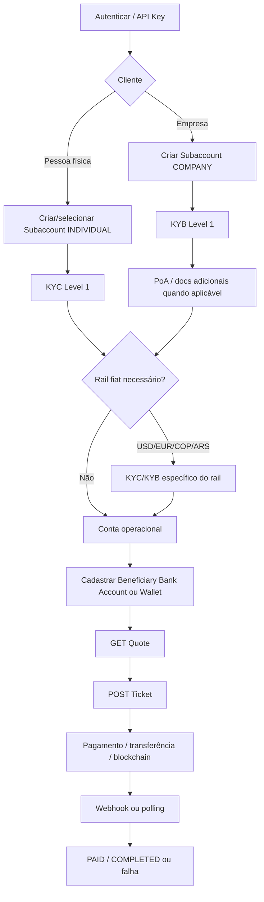

# Avenia

A integração da Avenia gira em torno de um modelo relativamente simples: **autenticar o integrador → criar/selecionar uma conta ou subconta → concluir KYC para pessoa física ou KYB para empresa → habilitar os trilhos fiat necessários → cadastrar destinos bancários/wallets quando aplicável → pedir uma cotação (`quote`) → criar um `ticket` → acompanhar o processamento por consulta ou webhook**. A API oferece autenticação por JWT e também por API Key assinada, esta última é explicitamente recomendada pela Avenia, e praticamente todos os recursos de negócio podem ser escopados para uma `subAccountId`. KYC/KYB são assíncronos, enquanto o dinheiro é movimentado pelo modelo **Quote → Ticket → Settlement/Status**.

## Mapa da documentação

| Seção | Abas encontradas |
|---|---|
| **Avenia Account Management** | Login; About Login; Accesses Management; Account Statement; Async Reports; Recovery Guide; Address & Proof of Address |
| **Avenia Subaccounts** | Subaccount Management |
| **Security** | MFA Guide; API Keys Managements; API Keys Guide |
| **KYC** | KYC Level 1; Sumsub Shared Token; USD; EUR; COP; ARS |
| **KYB** | Level 1 Web SDK; Level 1 API; Proof of Address; USD; EUR; COP; ARS |
| **Operations** | Operations Overview; Quotes and Tickets; Available Combinations; Ticket Receipt |
| **Beneficiaries Bank Accounts** | BRL; USD; EUR; COP; ARS |
| **Beneficiaries-Wallets** | Wallet's Guide |
| **Bank Accounts** | BRL; Static BR Code; COP; ARS |
| **Supported Banks** | Supported Banks COP; Supported Banks ARS |
| **Email Notifications** | Email Notifications |
| **Webhooks** | Webhook Management; Verifying Webhook Authenticity; Webhook Events |
| **Use cases** | PayOut <> BrCode; PIX2STABLE <> STABLE2PIX; PIX2STABLE <> OnChain Transfer |
| **Sandbox Usecases** | Receive Mock Funds; Simulate COP Deposit; Simulate ARS Deposit |

Em outras palavras, **Login é só uma pequena parte da integração**; o núcleo real está em Account/Subaccounts + KYC/KYB + Operations + Beneficiaries + Webhooks.

## Identidade, segurança e contas

**Account Management / Login.** O objetivo é obter uma sessão válida e administrar a conta. O fluxo de login é `POST /v2/auth/login` com `email` e `password` → Avenia envia um token por e-mail → `POST /v2/auth/validate-login` com `email` e `emailToken` → resposta com `accessToken` e `refreshToken`. Para renovação, `POST /v2/auth/refresh` recebe `refreshToken` e devolve um novo par de tokens. Login/validação não exigem Bearer; os endpoints de conta subsequentes usam autenticação. Os tokens devem ser tratados como segredos.

A aba **About Login** adiciona principalmente consultas de conta: `GET /v2/account/account-info` retorna informações da identidade, wallets e dados associados; `GET /v2/account/balances` retorna saldos por ativo; e `GET /v2/account/metadata` expõe flags como `brlUnlocked`, `usdUnlocked`, `eurUnlocked` e `arsUnlocked`. `subAccountId` permite executar essas consultas no contexto de uma subconta.

**Accesses Management.** Um *Access* é um login independente vinculado à Business Account, com credenciais, MFA e permissões próprias. Admins podem criar acessos para usuários ou serviços sem compartilhar a credencial principal. O gerenciamento usa `/v2/auth/accesses`: criação é feita em duas fases, admin envia e-mail, OTP e permissões; o novo usuário recebe token e define senha, e há GET/PATCH/DELETE para consultar, alterar e revogar acessos. Permissões importantes incluem `admin`, `payOut`, `viewOnly`, `markup`, `beneficiary` e restrições por subconta. Criar/alterar/remover acessos e gerenciar blacklist exige TOTP; somente administradores podem executar as operações administrativas.

**Recovery / sessão.** A documentação cobre alteração de senha com `PATCH /v2/auth/change-password`, recuperação em duas etapas com `POST /v2/auth/forgot-password` → token por e-mail → `PATCH /v2/auth/reset-password/{token}`, e logout via `POST /v2/auth/logout`, que invalida access e refresh tokens. Os principais inputs são senha atual/nova ou e-mail/token de recuperação; os outputs são essencialmente confirmação do fluxo, não um objeto de negócio.

**MFA.** O TOTP é registrado com `POST /v2/auth/mfa/totp/create`, que retorna `secret` e `qrCode`; depois `POST /v2/auth/mfa/totp/validate` recebe `otp` + `emailToken`. A remoção é igualmente em duas fases (`/remove/` e `/remove/confirm`). Um detalhe importante é que remover TOTP causa um **cooldown de segurança de 24 horas para operações que dependem dele**.

**API Keys.** A Avenia recomenda API Keys para integrações máquina-a-máquina. O cadastro usa `POST /v2/auth/api-keys/` com `name`, `publicKey`, `otp` e opcionalmente `whitelistedIPs`; é necessário TOTP e existe limite de cinco API Keys por Access. RSA, ECDSA e Ed25519 são suportados. GET lista as chaves, PATCH altera whitelist e DELETE revoga a chave.

Para autenticar uma chamada com API Key, a requisição é assinada usando timestamp + método HTTP + request URI + body quando existir; os cabeçalhos enviados são `X-API-Key`, `X-API-Timestamp` e `X-API-Signature`. Query parameters fazem parte da URI assinada.

**Subaccounts.** Servem para separar clientes/entidades da Business Account principal. `POST /v2/account/sub-accounts` recebe essencialmente `accountType` e `name` e retorna um `id`; depois esse ID é reutilizado como `subAccountId` em KYC, KYB, beneficiaries, operações e demais APIs compatíveis. GET lista ou consulta subcontas. Uma caveat importante: **subcontas são permanentes; DELETE retorna `405 Method Not Allowed`**.

**Account Statement, Reports e Address.** `Account Statement` expõe mudanças de saldo, com campos centrais `balanceChange`, `finalBalance`, `description` e paginação/filtro temporal. Os timestamps de filtro são epoch em **milissegundos UTC**. Async Reports adiciona um fluxo `POST → jobId → GET/poll → download`: `/v2/account/reports/statements` e `/transactions`, com estados `queued`, `running`, `success` e `failed`; resultados podem ser divididos em múltiplos arquivos e o recurso está marcado como **BETA**. O período máximo é 12 meses e há quota de 20 solicitações de relatório por conta/dia.

Address usa `GET/PUT /v2/account/address`; no PUT os principais campos obrigatórios são `streetLine1`, `city`, `countrySubdivision`, `zipCode` e `country`. Proof of Address segue upload do documento → `POST /v2/account/address/proof-of-address/api` com `uploadedPoAId` → polling de attempt ou webhook; a resposta inicial é um ID de tentativa e a final contém `status`, `result` e `resultMessage`.

## KYC e KYB

### KYC

**KYC, pessoa física.** O KYC Level 1 por API possui três passos: criar slots de upload → enviar os arquivos às URLs pré-assinadas → submeter dados pessoais e os IDs dos documentos. `POST /v2/documents/` recebe `documentType` e opcionalmente `isDoubleSided`, retornando `id`, `uploadURLFront` e eventualmente `uploadURLBack`; liveness pode retornar também `sessionId`, `livenessUrl` e `validateLivenessToken`. O upload é um PUT direto na URL pré-assinada, com `If-None-Match: *` e MIME compatível.

A submissão final é `POST /v2/kyc/new-level-1/api`. Os campos obrigatórios principais são `fullName`, `dateOfBirth`, `countryOfTaxId`, `taxIdNumber`, `email`, `country`, `state`, `city`, `zipCode`, `streetAddress`, `uploadedSelfieId` e `uploadedDocumentId`; `phone` e `sandboxReject` são opcionais. O output imediato é o `id` da tentativa. Acompanhamento ocorre via `GET /v2/kyc/attempts/`, GET por ID ou webhooks, produzindo principalmente `status`, `result`, `resultMessage`, `rejectionLabels` e `retryable`. País e estado usam códigos ISO.

O endpoint antigo `POST /v2/kyc/level-1/api` foi removido e retorna `404`; a rota atual é `/v2/kyc/new-level-1/api`.

Há também o **Web SDK**: `POST /v2/kyc/new-level-1/web-sdk`, opcionalmente com `redirectUrl`, retorna `attemptId` e `kycUrl`. O integrador redireciona o usuário, a Avenia/Sumsub coleta os dados e o status é consultado posteriormente. Para COMPANY, o mesmo endpoint retorna `authorizedRepresentativeUrl` e `basicCompanyDataUrl`.

O fluxo **Sumsub Shared Token** evita recolher KYC novamente quando o integrador já possui um KYC válido em sua própria conta Sumsub. `POST /v2/kyc/import-token/?subAccountId=...` recebe `importToken` e devolve `id` + mensagem de processamento. É exclusivo para `INDIVIDUAL`, exige a feature `SumsubSharedClient` e um token válido/não utilizado; sem a feature, a documentação especifica `401`.

**KYC por moeda.** Após Level 1 aprovado, existem ativações específicas para USD, EUR, COP e ARS. USD e EUR têm seus próprios requests de KYC e reutilizam o mesmo lifecycle `PENDING → PROCESSING → COMPLETED / APPROVED|REJECTED`; COP e ARS seguem o mesmo padrão. USD e EUR têm uma caveat importante: **os rails fiat não funcionam end-to-end no sandbox e `usdUnlocked`/`eurUnlocked` não ficam `true` ali**, mesmo que a submissão aparente sucesso.

#### Principais documentos aceitos:

- Documento de identidade (ID);
- Carteira de motorista (DRIVERS-LICENSE);
- Passaporte (PASSPORT);
- Selfie ou selfie com prova de vida (SELFIE-FROM-LIVENESS).

#### Principais informações pessoais enviadas:

- Nome completo;
- Data de nascimento;
- País de emissão do documento fiscal;
- CPF/TIN ou equivalente;
- E-mail e, opcionalmente, telefone;
- País, estado, cidade e CEP;
- Endereço;
- Identificador do documento enviado;
- Identificador da selfie/prova de vida.

### KYB

**KYB, empresas.** KYB ocorre sempre em uma subconta `COMPANY`. No fluxo server-to-server, a sequência é: criar subconta COMPANY → subir Certificate of Incorporation, documento fiscal e identificação dos UBOs → registrar cada UBO → submeter KYB Level 1 → acompanhar approval. Avenia aceita até 50 UBOs.

A submissão principal também utiliza `POST /v2/kyc/new-level-1/api?subAccountId=...`, mas o payload empresarial contém `uboIds`, `companyLegalName`, `companyRegistrationNumber`, `taxIdentificationNumberTin`, descrição da atividade, motivo da abertura, fonte de recursos/renda, número de funcionários, receita/volume estimados, endereço da empresa e IDs dos documentos corporativos. O output é novamente um `id` de attempt; o acompanhamento reutiliza a API de KYC attempts.

No **KYB Web SDK**, uma única chamada a `POST /v2/kyc/new-level-1/web-sdk?subAccountId=...` gera o attempt e dois links: um para o representante autorizado e outro para dados/documentos básicos da companhia.

**KYB Proof of Address** é uma etapa posterior e independente do Level 1: primeiro o documento é enviado e precisa ficar `ready`; depois seu ID é submetido para verificação. Level 1 aprovado é pré-requisito.

**KYB fiat.** USD/EUR exigem KYB Level 1 e requisitos adicionais de documentação financeira, incluindo Proof of Financial Capacity e Proof of Revenue; assim como no KYC individual, USD/EUR não podem ser testados end-to-end no sandbox. COP usa `POST /v2/kyc/cop/api` e ARS usa `POST /v2/kyc/ars/api`; o backend decide entre KYC e KYB pelo tipo da conta. Em ARS, se a empresa já passou por uma revisão empresarial de outro fiat rail, a documentação prevê um caminho de ativação simplificado.

#### Documentos mínimos para o KYB Level 1:

- Documento de constituição da empresa (CERTIFICATE-OF-INCORPORATION);
- Documento de identificação fiscal da empresa (COMPANY-TAX-IDENTIFICATION-DOCUMENT);
- Documento de identificação de cada UBO:
    - identidade;
    - carteira de motorista;
    - passaporte;
    - ou, no Level 1, autorização de residência.

#### Principais informações da empresa:

- Razão social;
- Número de registro da empresa;
- CNPJ/TIN;
- Descrição da atividade da empresa;
- Motivo da abertura da conta;
- Origem dos recursos e da renda;
- Número de funcionários;
- Receita anual estimada;
- Volume mensal estimado;
- Residência fiscal;
- Endereço completo;
- Site e redes sociais, quando aplicável;
- IDs dos documentos societários enviados.

## Operações, beneficiários e trilhos bancários

**Operations é o centro da movimentação financeira.** O padrão é sempre:

`Quote → quoteToken → Ticket → instrução de pagamento/execução → status/webhook → PAID/falha`.

A cotação é feita via `GET /v2/account/quote/fixed-rate`. Os inputs principais são `inputCurrency`, `inputPaymentMethod`, `outputCurrency`, `outputPaymentMethod`, um entre `inputAmount` ou `outputAmount`, além de `inputThirdParty` e `outputThirdParty`; `blockchainSendMethod` é necessário para determinadas entradas blockchain. Há também markups e `subAccountId`. A resposta traz principalmente `quoteToken`, montantes de entrada/saída, `appliedFees`, `basePrice` e `pairName`. Uma quote é válida por apenas **15 segundos**.

O ticket é criado via `POST /v2/account/tickets/`. O único elemento universal obrigatório é `quoteToken`; `externalId` é opcional. O restante varia conforme o rail: `ticketBlockchainOutput`, `ticketBrlPixOutput`, `ticketUsdOutput`, `ticketEurSepaOutput`, `ticketArsInput` etc. O resultado mínimo normalmente contém o ticket `id`; em on-ramps, pode também retornar `brCode`, dados bancários/de depósito e `expiration`.

É possível acompanhar com `GET /v2/account/tickets/` ou `GET /v2/account/tickets/{ticket-id}`. Os principais outputs incluem `id`, `externalId`, `status`, `reason`, `failureReason`, timestamps, quote original e blocos de sender/receiver específicos do rail. Para subconta, **o mesmo `subAccountId` deve estar na quote e no ticket**.

A matriz de combinações cobre, entre outros, PIX/BRL ↔ stablecoins, USD WIRE/ACH ↔ stablecoins, EUR/SEPA ↔ EURC, COP via BANK-TRANSFER/Bre-B, ARS via BANK-TRANSFER, crypto→fiat e crypto→crypto/cross-chain. Em PIX→crypto, por exemplo, o ticket pode devolver um `brCode`; em USD→crypto, devolve instruções bancárias para depósito.

`GET /v2/account/tickets/{ticket-id}/receipt` gera um PDF somente para tickets em `PAID`; aceita opcionalmente `subAccountId` e exige JWT ou API Key.

**Beneficiary Wallets.** São wallets externas salvas para reutilização em payouts/on-chain. `POST /v2/account/beneficiaries/wallets/` recebe obrigatoriamente `alias`, `walletAddress` e `walletChain`; `description` e `walletMemo` são opcionais. O ID retornado passa a ser usado como `beneficiaryWalletId` em tickets. `subAccountId` é suportado.

**Beneficiary Bank Accounts.** O padrão é cadastrar um beneficiário → receber seu `id` → usar esse ID em um ticket de saída. Os endpoints têm famílias `/v2/account/beneficiaries/bank-accounts/{currency}/`, com POST/GET/GET-by-ID/DELETE e suporte a `subAccountId`.

Em **BRL**, os principais dados são `alias` e, alternativamente, uma `pixKey` ou o conjunto bancário (`userName`, `bankCode`, `branchCode`, `accountNumber`, `accountType`, `taxId`). Em **USD**, entram `bankAccountNumber`, `bankRoutingNumber`, `bankBeneficiaryName`, `bankName` e endereço do beneficiário; o ID é usado em WIRE/ACH. Em **EUR**, entram `iban`, `country`, `bankBeneficiaryName` e opcionalmente `bic`; a Avenia suporta **SEPA, não SWIFT**.

Em **COP**, existem dois modelos: banco/PSE, com dados bancários completos e `bankId`, ou **Bre-B**, que pode ser cadastrado apenas com `breBKey`; ambos podem coexistir no mesmo beneficiário. As transferências são irreversíveis. Em **ARS**, a saída utiliza CVU/CBU de 22 dígitos e dados completos do beneficiário; também é considerada irreversível.

**Bank Accounts** representa principalmente os rails/dados da própria conta Avenia, em oposição aos beneficiaries que representam destinos externos. O Bank Account BRL é inicializado junto com a Business Account e `GET /v2/account/bank-accounts/brl/` retorna `id`, `status`, `bankName`, `pixKey`, `ispb`, `bankCode`, agência, conta e tipo.

Para PIX estático existe `GET /v2/account/bank-accounts/brl/static-br-code`, com `referenceLabel` obrigatório e `amount`, `additionalData` e `subAccountId` opcionais; retorna `brCode`.

Para COP há `GET /v2/account/bank-accounts/cop/bre-b-info?breBKey=...`, que valida a chave e retorna `holderName` e `holderIdNumber` mascarados; chave inexistente resulta em `404` e parâmetro ausente/malformado em `400`. Para ARS, não existe etapa separada de lookup: quote → ticket com `ticketArsInput.senderAccountNumber` → resposta com `cvu`, `bankName` e `expiration`; o valor e a conta de origem ficam vinculados ao depósito.

**Supported Banks** fornece os catálogos oficiais para COP e ARS. Em COP, o `bankId` desse catálogo deve ser usado ao cadastrar beneficiários; a documentação recomenda tratar esse identificador como o contrato canônico em vez de IDs internos de provedores. Para ARS, há uma aba equivalente específica. Os demais detalhes que não foram explicitados nas páginas resumidas aqui ficam como **não especificado**.

## Notificações, casos de uso e sandbox

**Email Notifications.** `PUT /v2/notifications/email-config/` configura `email` e `subscriptions`; a assinatura central documentada é `TICKET`. A conta principal já nasce com algumas notificações críticas habilitadas no e-mail padrão, e a configuração pode ser alterada ou ampliada.

**Webhooks.** São a principal forma de receber eventos assíncronos. O fluxo é registrar URL + subscriptions em `POST /v2/notifications/webhooks/` → receber `webhookId` → Avenia persiste eventos e tenta entregá-los → o integrador pode consultar eventos e delivery attempts. São permitidas até três URLs. As subscriptions de alto nível incluem `TICKET`, `KYC`, `LIMIT-UPDATE` ou `*`; PATCH altera URL/assinaturas.

Eventos podem ser recuperados em `GET /v2/notifications/webhooks/events/`; a resposta contém `events`, cada um com `id`, `subscription`, `data`, timestamps e tipo, mais `cursor`. Há também API de attempts de entrega, útil para conciliação e diagnóstico.

No recebimento, **não confie simplesmente na URL/origem**: cada webhook possui uma assinatura, e a chave pública atual da Avenia deve ser obtida via `GET /v2/public-key` e usada para verificar a assinatura contra o corpo original. A própria documentação alerta que a chave pode ser rotacionada.

Os eventos atualmente documentados cobrem pelo menos `TICKET`, `KYC` e `LIMIT-UPDATE`; KYC, por exemplo, passa por eventos como `KYC-STARTED`, `KYC-PROCESSING`, `KYC-EXPIRED` e `KYC-COMPLETED`.

**Use cases.** Não introduzem uma segunda API; são guias compostos mostrando como encadear os recursos anteriores. As abas atuais são `PayOut <> BrCode`, `PIX2STABLE <> STABLE2PIX` e `PIX2STABLE <> OnChain Transfer`. O guia de PayOut/BrCode, por exemplo, começa com autenticação, recomendando API Keys, e então combina os endpoints de conta/operação para executar o payout.

**Sandbox Usecases.** Existem três abas: `Receive Mock Funds`, `Simulate COP Deposit` e `Simulate ARS Deposit`. Receive Mock Funds reutiliza `GET /v2/account/quote/fixed-rate` e o fluxo de tickets para simular recebimento via PIX e abastecer saldo de teste. Os endpoints/inputs específicos das simulações COP e ARS além do fluxo padrão são **não especificados nesta síntese**.

## Comparativo e fluxo típico

| Section | Main Flows | Key Inputs | Key Outputs | Auth Required |
|---|---|---|---|---|
| **Account Management / Login** | Login → e-mail token → validate → refresh | `email`, `password`, `emailToken`, `refreshToken` | `accessToken`, `refreshToken` | Login: **não**; conta: **sim** |
| **Account/Reports/Address** | Consultar conta/saldo; statement; gerar report; endereço/PoA | `subAccountId`, filtros temporais, período do report, campos de endereço, `uploadedPoAId` | conta, balances, logs, `jobId`/arquivos, PoA result | **Sim** |
| **Security** | MFA; criar/revogar API Keys; assinar requests | `otp`, `emailToken`, `publicKey`, `whitelistedIPs`, signature | `secret`, `qrCode`, `apiKey` | **Sim** |
| **Subaccounts** | Create → obter ID → usar ID nos demais recursos | `accountType`, `name` | `id`, dados da subconta | **Sim/padrão de conta**; exemplo da página de criação omite Bearer |
| **KYC** | Upload docs → submit Level 1 → poll/webhook → ativar rail | dados pessoais, selfie/document IDs, `subAccountId` | attempt `id`, `status`, `result`, rejection info | **Sim** |
| **KYB** | COMPANY → docs → UBOs → KYB → rail | dados societários, UBOs, documentos, `subAccountId` | attempt `id`, `status`, `result`, unlocks | **Sim** |
| **Operations** | Quote → Ticket → pagamento/transferência → monitoramento | moedas, payment methods, amount, `quoteToken`, destino | quote/fees; ticket `id`; instruções; status | **Sim** |
| **Beneficiary Bank Accounts** | Create/list/get/delete destino fiat | dados bancários específicos por BRL/USD/EUR/COP/ARS | beneficiary `id` + cadastro | **Sim** |
| **Beneficiary Wallets** | Registrar wallet → usar no ticket | `alias`, `walletAddress`, `walletChain` | beneficiary wallet ID | **Sim** |
| **Bank Accounts / Supported Banks** | Consultar rail próprio; PIX QR; Bre-B lookup; catálogos | `subAccountId`, `referenceLabel`, `breBKey`, etc. | dados bancários, `brCode`, holder info, bank IDs | **Sim** nos endpoints documentados |
| **Email/Webhooks** | Configurar assinatura → receber eventos → verificar assinatura | URL, subscriptions, e-mail | `webhookId`, events, attempts | Management: **sim**; webhook recebido: assinatura criptográfica |
| **Use cases / Sandbox** | Composição dos fluxos acima | Depende do caso | Depende do ticket | Conforme endpoint subjacente |

O onboarding conceitual típico pode ser representado assim:

